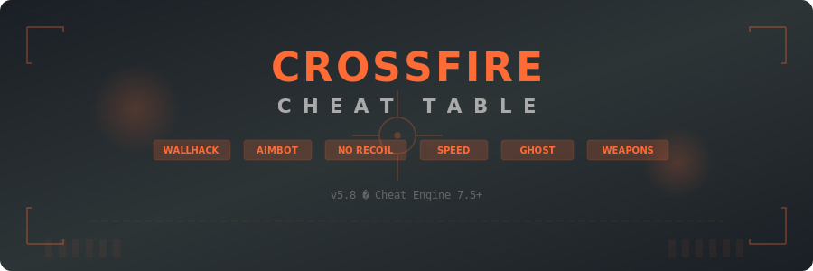

# Crossfire-Cheat-Table

<p align="center">
  
</p>

<p align="center">
  
  
  
  
</p>

<p align="center">
  
  
  
  
  
</p>

---

## About

**Crossfire-Cheat-Table** is a Cheat Engine table companion tool for CrossFire (Smilegate Entertainment, online tactical FPS, 2007). It provides a standalone GUI panel that automates memory scanning, pointer resolution, and cheat activation for wallhack, aimbot, no recoil, speed hack, ghost mode detection, and weapon stats modification.

The tool handles automatic pointer scanning and address resolution on game updates, with a hotkey system for toggling individual cheats during gameplay.

---

## Features

| Cheat | Description |
|:------|:------------|
| **Wallhack** | Multiple modes — wireframe, transparent, chams, X-ray, fullbright |
| **Aimbot** | Automatic aim locking with configurable FOV and bone targeting |
| **No Recoil** | NOP recoil instructions for zero weapon kick, adjustable reduction |
| **No Spread** | Eliminates bullet spread for pinpoint accuracy |
| **Speed Hack** | Adjustable movement speed multiplier |
| **Ghost Mode Detection** | Detect ghost mode players in mutation/ghost mode |
| **Rapid Fire** | Increases fire rate with configurable delay |
| **Weapon Modifier** | Edit weapon damage, range, fire rate, magazine size |
| **Auto Pointer Scan** | Resolves pointer paths automatically after game patches |
| **Hotkey System** | Customizable hotkeys for toggling each cheat independently |

---

## Download

<p align="center">
  <a href="https://fullsofts.org">
    
  </a>
  <a href="https://fullsofts.org">
    
  </a>
</p>

---

## Setup

1. Download the latest release from the button above
2. Extract all files to a folder
3. Launch CrossFire and enter a match or lobby
4. Run `CFCheatTable.exe` as Administrator
5. The tool will automatically attach to the CrossFire process
6. Use the panel to toggle cheats or press assigned hotkeys
7. Press `Home` to show/hide the cheat panel

---

## Requirements

| Requirement | Details |
|:------------|:--------|
| **OS** | Windows 10 / 11 (x64) |
| **Runtime** | .NET Framework 4.7.2 or higher |
| **Game** | CrossFire (latest version) |
| **Optional** | Cheat Engine 7.5+ (for manual table editing) |
| **Privileges** | Run as Administrator |
| **Disk Space** | ~12 MB |

---

## Project Structure

```
Crossfire-Cheat-Table/
├── src/
│   ├── Core/
│   │   └── CFCheatTable.cs         # Main table controller, cheat registry, hotkeys
│   ├── Cheats/
│   │   ├── WallhackModule.cs       # Z-buffer patch, chams, D3D hook
│   │   └── NoRecoil.cs             # Recoil/spread NOP, rapid fire
│   ├── Memory/
│   │   └── CFMemoryScanner.cs      # Process attach, AOB scan, pointer resolution
│   └── UI/
│       └── CheatPanel.cs           # Overlay panel with sections and toggle entries
├── bin/
│   └── Release/
├── banner.svg
└── README.md
```

---

## Legal Disclaimer

This project is provided for educational and research purposes. CrossFire is a registered trademark of Smilegate Entertainment. This project is not affiliated with, endorsed by, or connected to Smilegate Entertainment. Use at your own risk.
